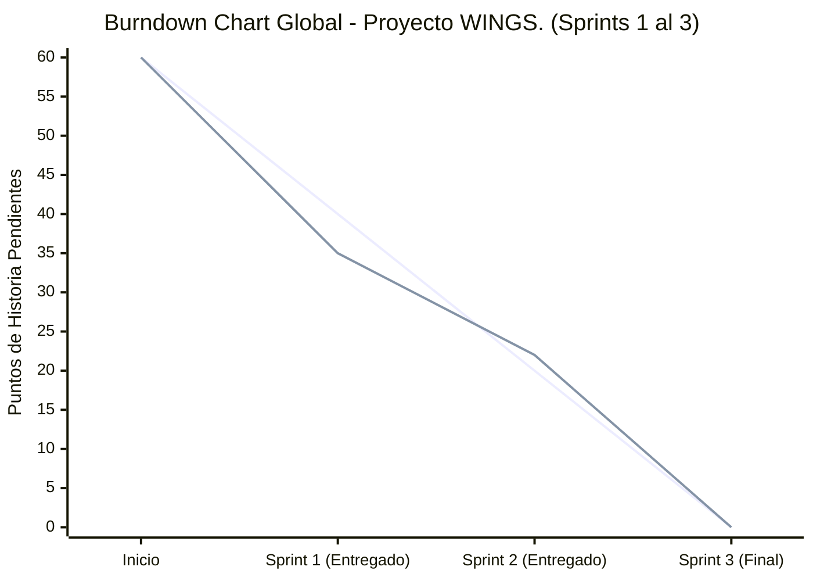

### Gráfica Burndown Global — Proyecto WINGS. (Sprints 1, 2 y 3)

```mermaid
xychart-beta
    title "Burndown Chart Global - Proyecto WINGS. (Sprints 1 al 3)"
    x-axis ["Inicio", "Sprint 1 (Entregado)", "Sprint 2 (Entregado)", "Sprint 3 (Final)"]
    y-axis "Puntos de Historia Pendientes" 0 --> 60
    line "Trabajo Ideal" [60, 40, 20, 0]
    line "Trabajo Real" [60, 35, 22, 0]
```
