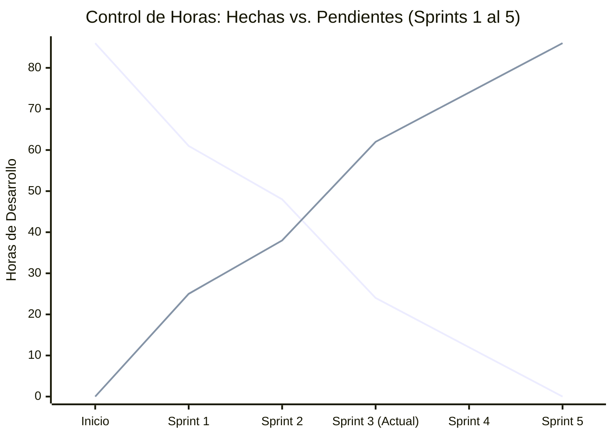

### Gráfica Burndown de Horas — Proyecto WINGS. (24 Horas Pendientes)

```mermaid
xychart-beta
    title "Control de Horas: Hechas vs. Pendientes (Sprints 1 al 5)"
    x-axis ["Inicio", "Sprint 1", "Sprint 2", "Sprint 3 (Actual)", "Sprint 4", "Sprint 5"]
    y-axis "Horas de Desarrollo" 0 --> 86
    line "Horas Pendientes" [86, 61, 48, 24, 12, 0]
    line "Horas Hechas" [0, 25, 38, 62, 74, 86]
```
