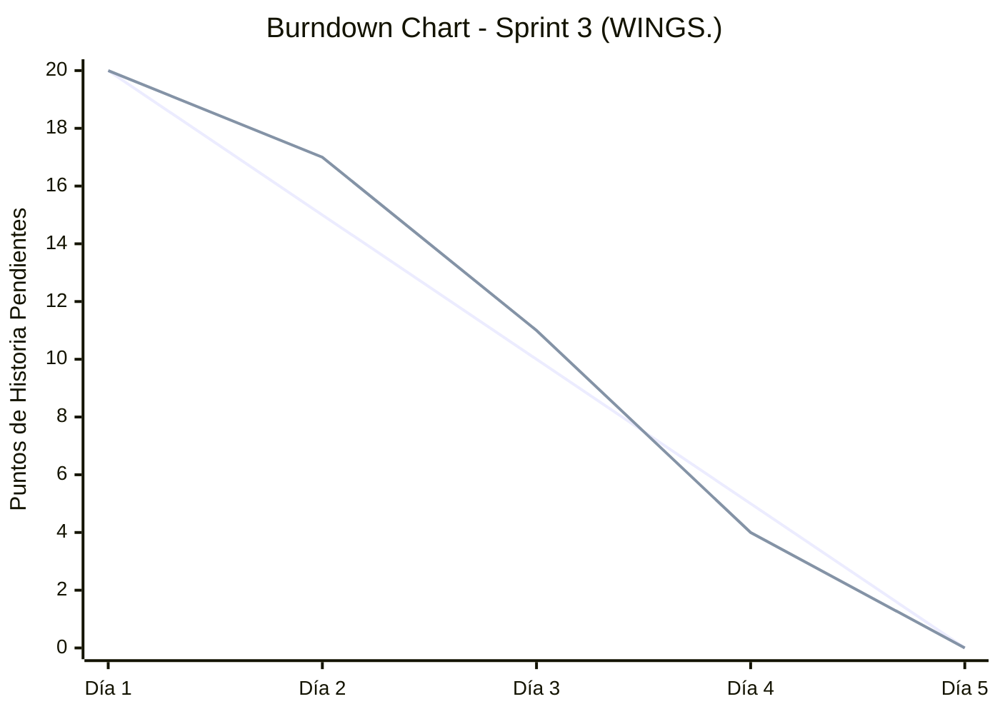

### Gráfica Burndown — Sprint 3 (WINGS.)

```mermaid
xychart-beta
    title "Burndown Chart - Sprint 3 (WINGS.)"
    x-axis ["Día 1", "Día 2", "Día 3", "Día 4", "Día 5"]
    y-axis "Puntos de Historia Pendientes" 0 --> 20
    line "Trabajo Ideal" [20, 15, 10, 5, 0]
    line "Trabajo Real" [20, 17, 11, 4, 0]
```
