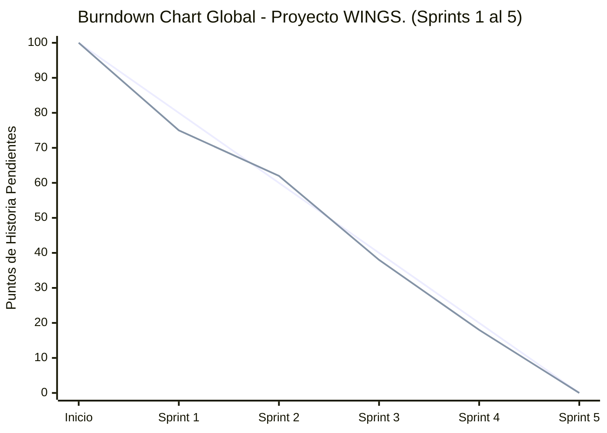

### Gráfica Burndown Global — Proyecto WINGS. (Sprints 1 al 5)

```mermaid
xychart-beta
    title "Burndown Chart Global - Proyecto WINGS. (Sprints 1 al 5)"
    x-axis ["Inicio", "Sprint 1", "Sprint 2", "Sprint 3", "Sprint 4", "Sprint 5"]
    y-axis "Puntos de Historia Pendientes" 0 --> 100
    line "Trabajo Ideal" [100, 80, 60, 40, 20, 0]
    line "Trabajo Real" [100, 75, 62, 38, 18, 0]
```
